# WoowTech Odoo WooCommerce Integration

<p align="center">
  
  
  
  
  
</p>

<p align="center">
  <b>Enterprise-grade WooCommerce to Odoo order synchronization with real-time webhook processing, automatic product/customer matching, and full stock management.</b>
</p>

<p align="center">
  <a href="README_zh-TW.md">繁體中文</a> &middot; <a href="#architecture">Architecture</a> &middot; <a href="#installation">Installation</a> &middot; <a href="#screenshots">Screenshots</a>
</p>

---

## Overview

| Challenge | Solution |
|-----------|----------|
| WooCommerce orders not reflected in Odoo | Real-time webhook sync + daily cron backup |
| Product names differ between WC and Odoo | Intelligent fuzzy matching + manual mapping table |
| Customer data scattered across platforms | Automatic partner matching by email/phone |
| Stock levels out of sync | Auto-deduction on completed orders |
| No visibility into sync status | Dedicated queue with state tracking and error reporting |
| Complex historical migration | Built-in import wizard with date/status filters |

## Features

### Core Capabilities

- **Real-time Webhook Sync** -- Receives WooCommerce order events instantly via HTTP POST
- **Queue-based Processing** -- Reliable async processing with retry mechanism (up to 5 attempts)
- **Automatic Product Matching** -- Fuzzy name matching + persistent mapping table with chatter
- **Automatic Customer Matching** -- Email/phone-based matching + persistent partner mapping
- **Auto-confirm Orders** -- Optionally auto-confirm synced orders as Sale Orders
- **Auto-deduct Stock** -- Validates delivery for completed WC orders (Odoo 18 compatible)
- **Historical Import** -- Bulk import wizard with date range and status filters
- **Duplicate Detection** -- Prevents re-processing of already-synced orders
- **Health Monitoring** -- `/wc_sync/health` endpoint returns live queue statistics
- **HMAC Signature Verification** -- Optional webhook security with SHA-256 signatures
- **Daily Cron Job** -- Automated background processing of pending queue items
- **i18n Support** -- English source + Traditional Chinese (zh_TW) translations

### Permission System

Three-tier role-based access control:

| Role | Sync Queue | Product Map | Partner Map | Settings | Import |
|------|-----------|-------------|-------------|----------|--------|
| **No Group** | Hidden | Hidden | Hidden | Hidden | Hidden |
| **WC User** | Read-only | Read-only | Read-only | Hidden | Hidden |
| **WC Manager** | Full CRUD | Full CRUD | Full CRUD | Full Access | Full Access |

## Architecture

### System Overview

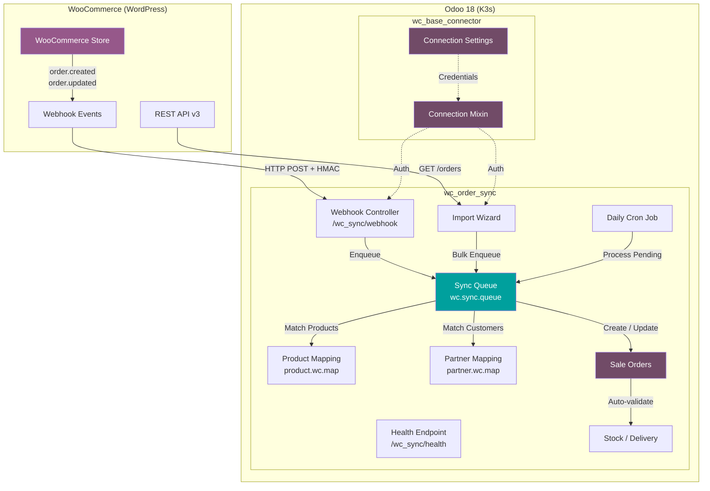

### Data Flow

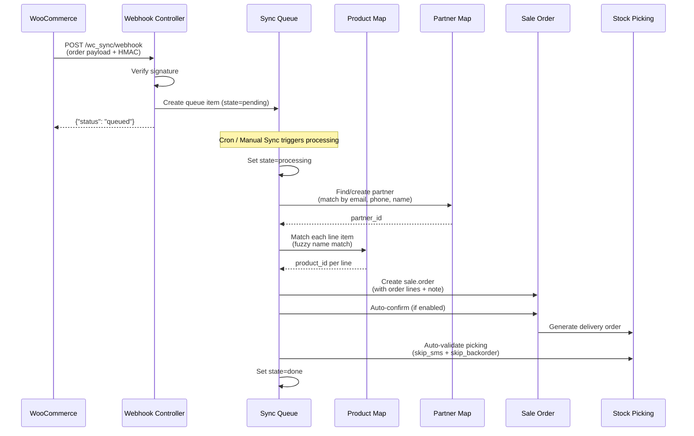

### Module Dependency

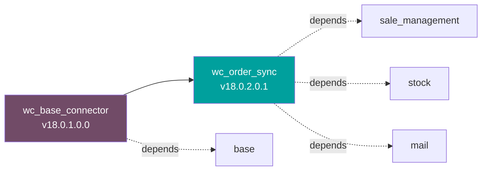

## Modules

### wc_base_connector (Base)

| Field | Value |
|-------|-------|
| **Version** | 18.0.1.0.0 |
| **Dependencies** | `base` |
| **Purpose** | Shared WooCommerce connection settings and authentication mixin |

**Key Components:**
- `res.config.settings` -- WooCommerce URL, API username, API password
- `wc.connection.mixin` -- Reusable AbstractModel for API authentication
- Security groups: `group_wc_user`, `group_wc_manager`
- **Test Connection** button for validating API credentials

### wc_order_sync (Order Sync)

| Field | Value |
|-------|-------|
| **Version** | 18.0.2.0.1 |
| **Dependencies** | `sale_management`, `stock`, `mail`, `wc_base_connector` |
| **Purpose** | Order synchronization, product/partner mapping, queue processing |

**Key Components:**
- `wc.sync.queue` -- Order processing queue with state machine (pending -> processing -> done/error)
- `product.wc.map` -- WC-Odoo product mapping with `mail.thread` chatter
- `partner.wc.map` -- WC-Odoo partner mapping with `mail.thread` + tracking
- `sale.order` extension -- `wc_order_id`, `wc_order_status`, `wc_payment_method` fields
- Webhook controller at `/wc_sync/webhook` (JSON, no auth, HMAC optional)
- Health check at `/wc_sync/health` (HTTP GET)
- Historical import wizard with date/status/limit filters
- Daily cron job for automated processing

## Installation

### Prerequisites

- Odoo 18 Community or Enterprise
- Python `requests` library
- WooCommerce store with REST API v3 enabled
- Application Password for WC API authentication

### Steps

1. **Copy modules** to your Odoo addons directory:

```bash
cp -r wc_base_connector wc_order_sync /path/to/odoo/addons/
```

2. **Update apps list** in Odoo:
   - Settings -> Apps -> Update Apps List

3. **Install modules** (order matters):
   - Install `wc_base_connector` first
   - Install `wc_order_sync` second

4. **Configure connection**:
   - Settings -> WooCommerce
   - Enter your WooCommerce store URL, API username, and Application Password
   - Click **Test Connection** to verify

5. **Configure sync settings**:
   - Enable Auto-confirm Orders (recommended)
   - Enable Auto-deduct Stock for completed orders
   - Set a Default Product as fallback for unmatched items
   - Optionally set a Webhook Secret for HMAC verification

6. **Set up WooCommerce webhook**:
   - In WooCommerce -> Settings -> Advanced -> Webhooks
   - Add a new webhook:
     - **Delivery URL**: `https://your-odoo.com/wc_sync/webhook`
     - **Topic**: Order created / Order updated
     - **Secret**: Same as your Odoo Webhook Secret setting

### K3s / Kubernetes Deployment

For containerized deployments, ensure:
- The Odoo pod has `requests` Python package available
- The webhook endpoint is exposed via Ingress or Cloudflare Tunnel
- The cron job runs within the Odoo container scheduler

## Screenshots

### Home Menu -- WooCommerce App
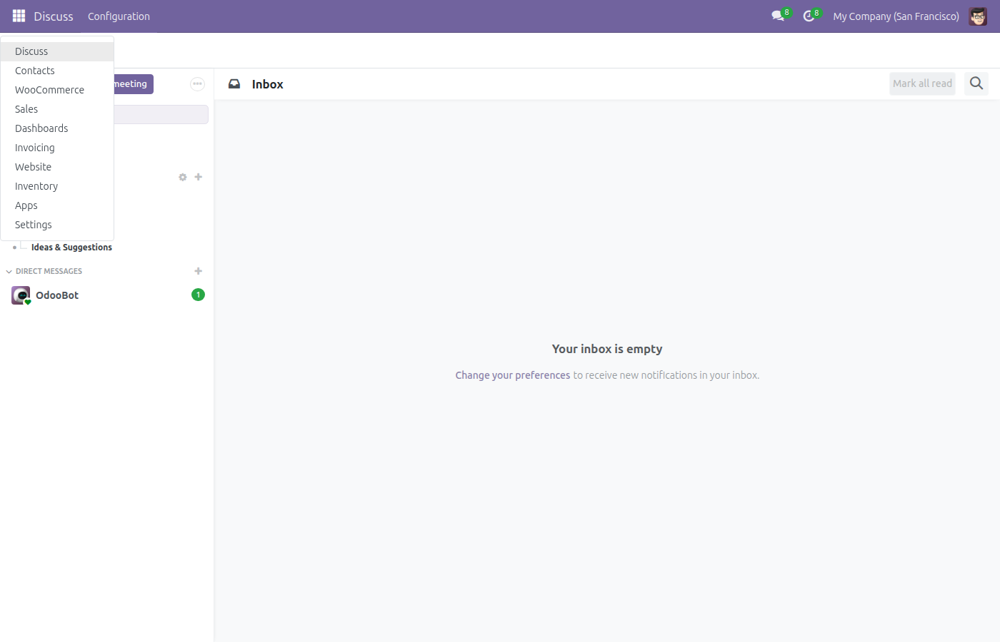
*WooCommerce appears as a dedicated app in the Odoo home menu (visible only to authorized users)*

### Sync Queue -- List View
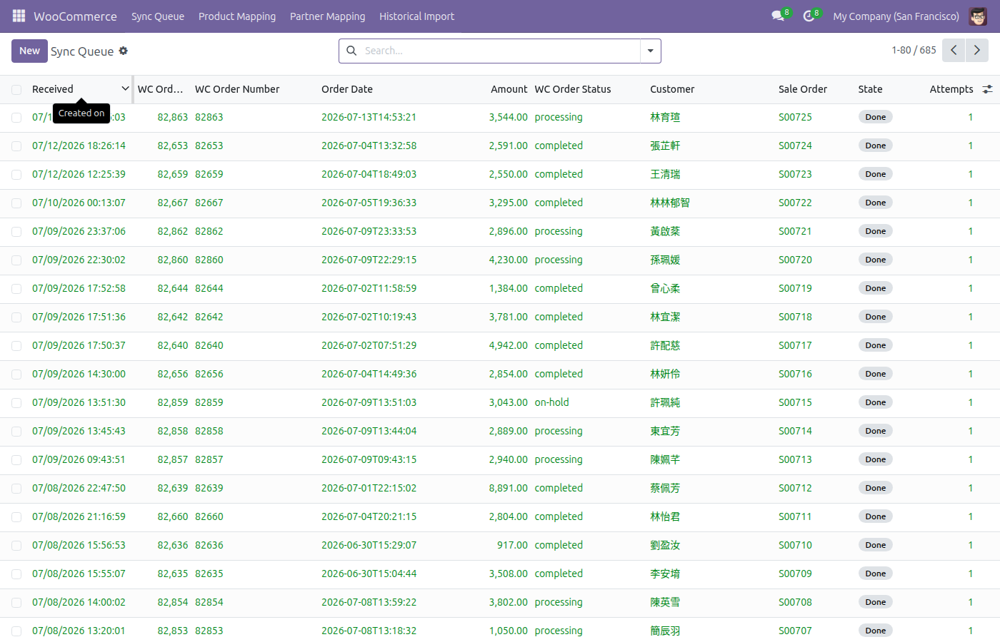
*Real-time queue showing all synced orders with status, amounts, and linked Sale Orders*

### Sync Queue -- Form View
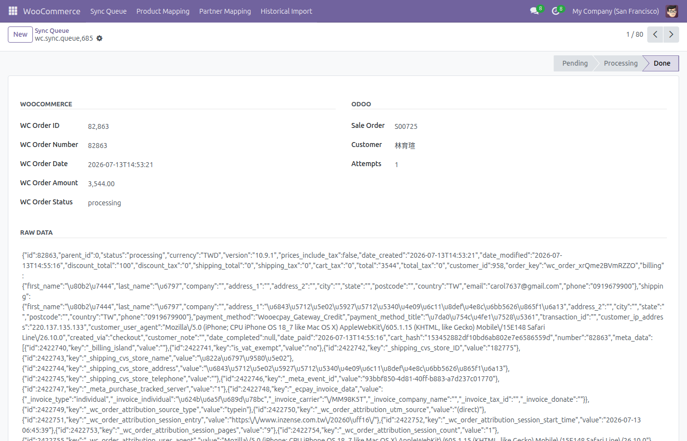
*Detailed view of a synced order showing WooCommerce data, Odoo mapping, and raw JSON payload*

### Product Mapping -- List View
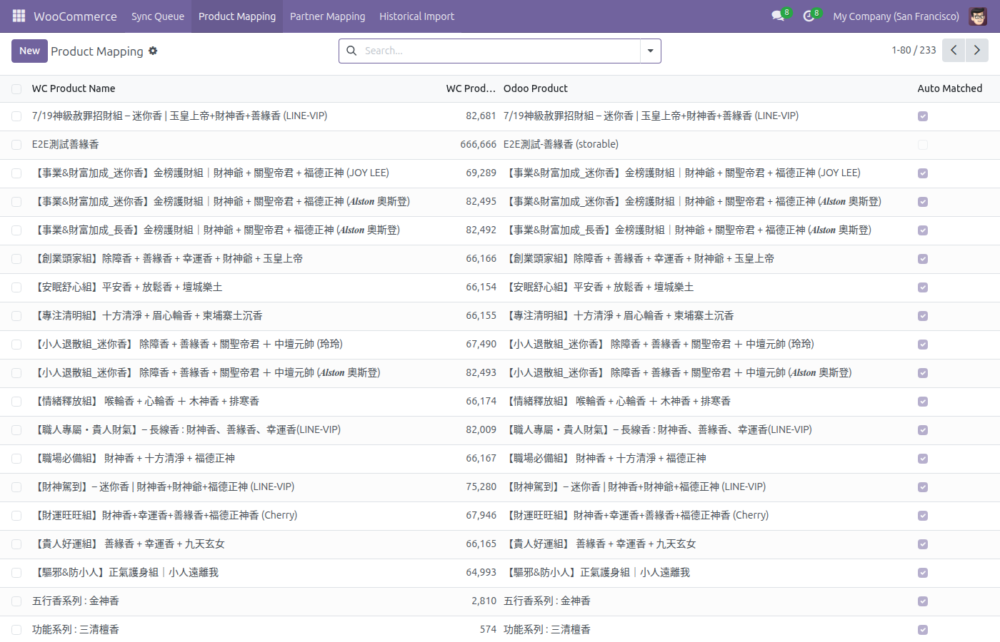
*233 product mappings with auto-match indicators -- WooCommerce product names linked to Odoo products*

### Product Mapping -- Form with Chatter
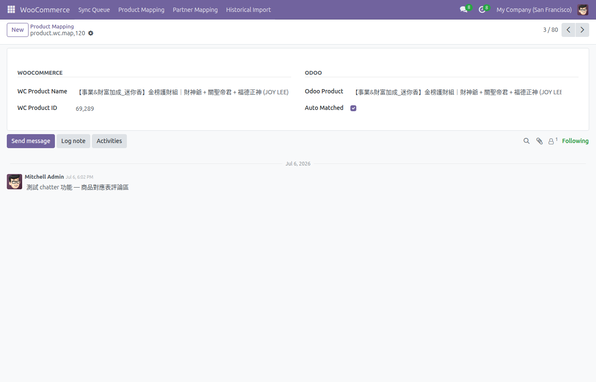
*Product mapping detail with Odoo native chatter for team collaboration and tracking*

### Partner Mapping -- List View
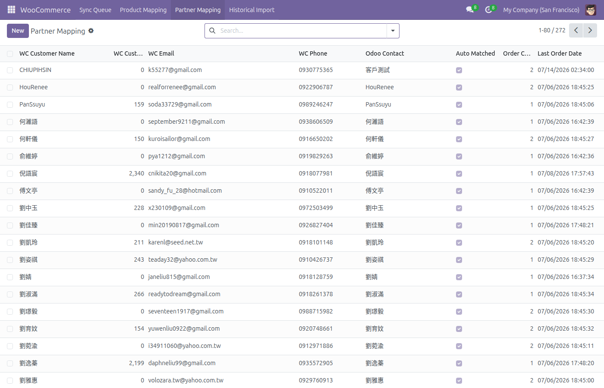
*272 customer mappings with email, phone, order count, and last order date*

### Partner Mapping -- Form with Chatter
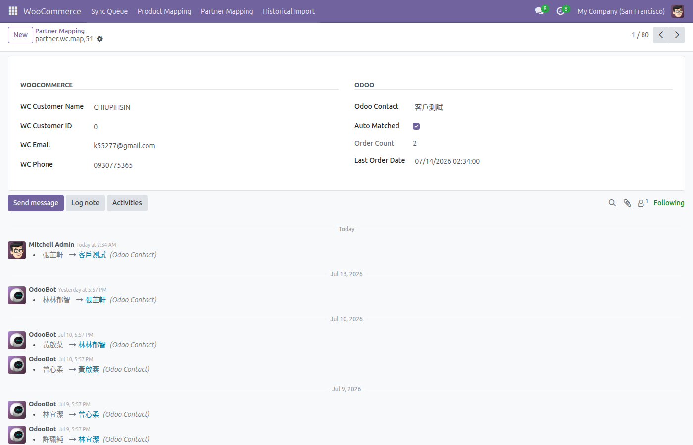
*Partner mapping with full tracking history -- every field change is logged automatically*

### Settings -- WooCommerce Configuration
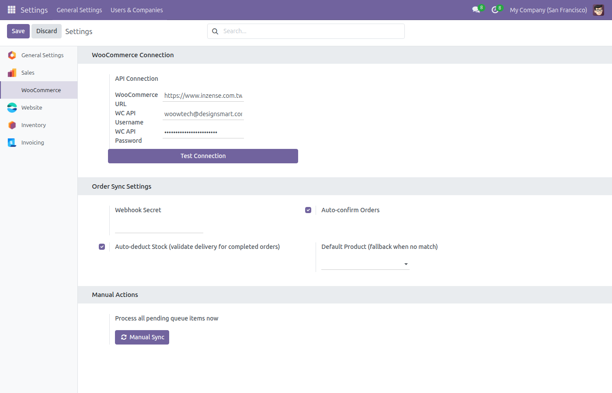
*Centralized configuration: API connection, sync options, and manual sync trigger*

### Historical Import Wizard
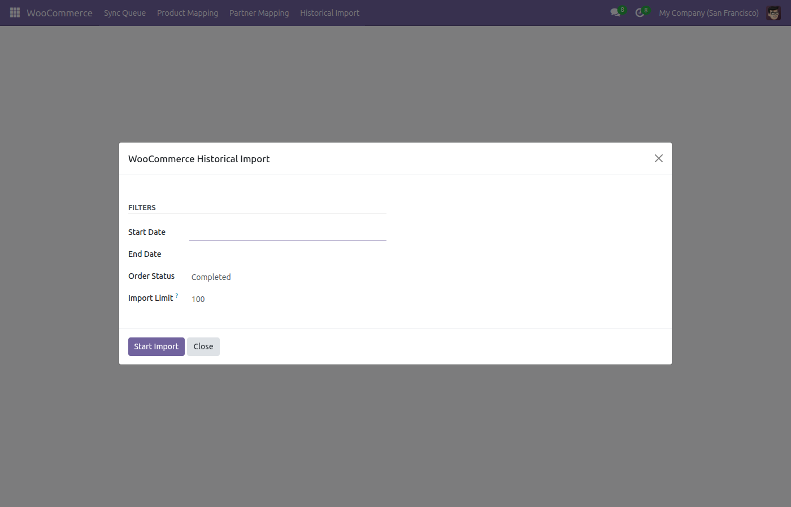
*Bulk import wizard for migrating historical WooCommerce orders with date and status filters*

### Sale Order -- Created from WooCommerce
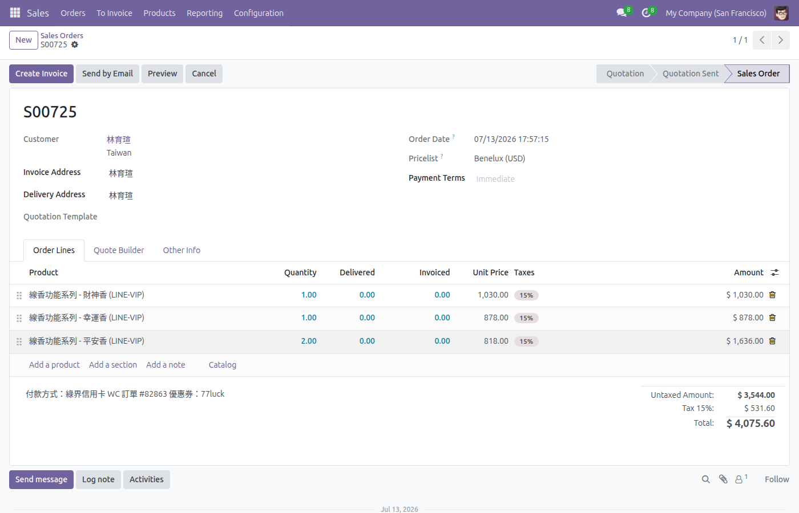
*Auto-created Sale Order with matched products, tax calculation, and WC payment method note*

### Inventory -- Stock Integration
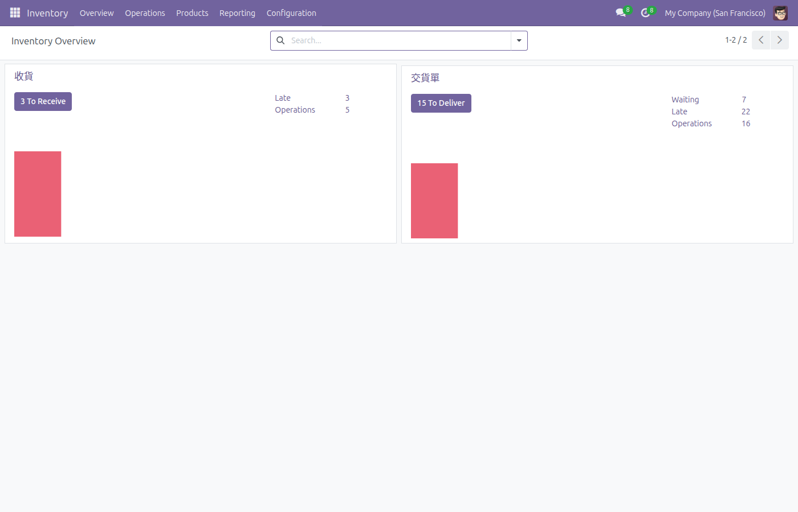
*Automated stock deduction through delivery order validation for completed WC orders*

## API Reference

### Webhook Endpoint

```
POST /wc_sync/webhook
Content-Type: application/json
X-WC-Webhook-Signature: <HMAC-SHA256> (optional)
```

**Request Body**: WooCommerce order JSON payload

**Responses**:

| Status | Body | Description |
|--------|------|-------------|
| 200 | `{"status": "queued", "queue_id": 123}` | Order enqueued for processing |
| 200 | `{"status": "duplicate", "queue_id": 123}` | Order already exists in queue |
| 200 | `{"status": "ok", "message": "ping acknowledged"}` | Empty payload (WC ping) |
| 200 | `{"status": "skipped", "reason": "..."}` | Order status not in sync list |
| 403 | `{"status": "error", "message": "Invalid signature"}` | HMAC verification failed |

### Health Check Endpoint

```
GET /wc_sync/health
```

**Response**:
```json
{
  "status": "ok",
  "queue": {
    "pending": 0,
    "errors": 0,
    "done": 685
  }
}
```

## Configuration

### Config Parameters

| Key | Description | Default |
|-----|-------------|---------|
| `wc_base_connector.wc_url` | WooCommerce store URL | -- |
| `wc_base_connector.wc_username` | WC API username | -- |
| `wc_base_connector.wc_password` | WC API password (Application Password) | -- |
| `wc_order_sync.webhook_secret` | HMAC webhook secret | -- |
| `wc_order_sync.auto_confirm` | Auto-confirm orders | `True` |
| `wc_order_sync.auto_stock` | Auto-deduct stock | `True` |
| `wc_order_sync.default_product_id` | Fallback product ID | -- |

## Security

- **RBAC**: Three-tier permission model (No Group / User / Manager)
- **HMAC-SHA256**: Optional webhook signature verification
- **No Auth Webhook**: Designed for WooCommerce callbacks; protected by HMAC when configured
- **ACL Matrix**: Separate read/write permissions per model per group
- **Private Methods**: Internal processing methods (`_cron_*`, `_process_*`) not callable via RPC

## Testing Results

Enterprise-grade testing completed across 5 rounds:

| Round | Scope | Result |
|-------|-------|--------|
| **Round 1** | Playwright UI (login, menus, forms, chatter) | 13/13 tests passed |
| **Round 2** | API backend (webhook, health, JSON-RPC, edge cases) | 14/14 tests passed |
| **Round 3** | End-to-end real WC order sync | All data integrity verified |
| **Round 4** | Permission isolation (Manager/User/None) | 10/10 tests passed |
| **Round 5** | Enterprise deployment scoring | **97/100** |

**Test Data**: 685 orders synced, 233 product mappings, 272 partner mappings -- zero errors.

## Support & License

- **Author**: [WoowTech](https://github.com/WOOWTECH)
- **License**: LGPL-3
- **Odoo Version**: 18.0
- **Repository**: [github.com/WOOWTECH/Woow_odoo_woo_commerce](https://github.com/WOOWTECH/Woow_odoo_woo_commerce)
