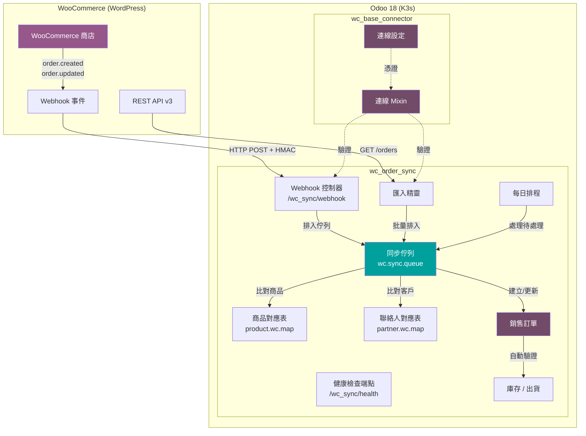
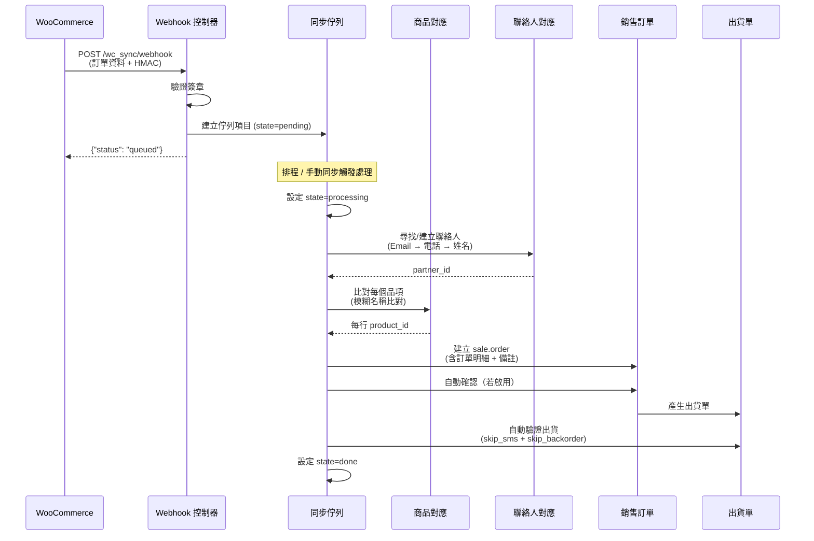
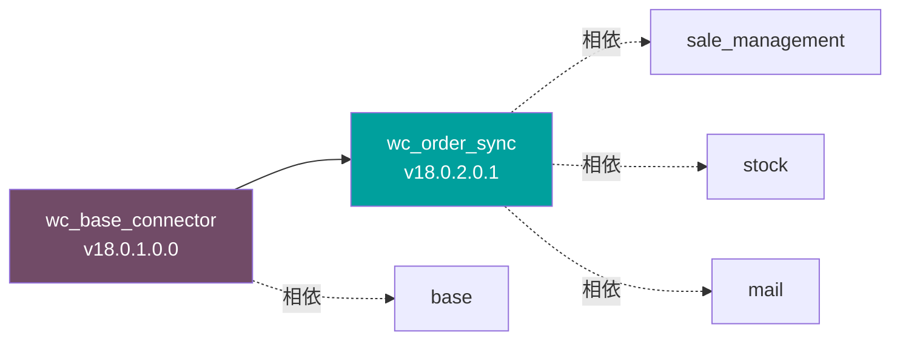

# WoowTech Odoo WooCommerce 整合套件

<p align="center">
  
  
  
  
  
</p>

<p align="center">
  <b>企業級 WooCommerce 至 Odoo 訂單同步方案，支援即時 Webhook 處理、自動商品/客戶比對及完整庫存管理。</b>
</p>

<p align="center">
  <a href="README.md">English</a> &middot; <a href="#架構">架構</a> &middot; <a href="#安裝">安裝</a> &middot; <a href="#截圖">截圖</a>
</p>

---

## 概述

| 挑戰 | 解決方案 |
|------|---------|
| WooCommerce 訂單未反映在 Odoo 中 | 即時 Webhook 同步 + 每日排程備援 |
| WC 與 Odoo 商品名稱不同 | 智慧模糊比對 + 手動對應表 |
| 客戶資料散落在不同平台 | 自動以 Email / 電話 / 姓名比對聯絡人 |
| 庫存數量不同步 | 已完成訂單自動扣庫存 |
| 無法了解同步狀態 | 專用佇列含狀態追蹤與錯誤回報 |
| 歷史訂單遷移複雜 | 內建匯入精靈含日期/狀態篩選 |

## 功能特色

### 核心功能

- **即時 Webhook 同步** -- 透過 HTTP POST 即時接收 WooCommerce 訂單事件
- **佇列式處理** -- 可靠的非同步處理，含重試機制（最多 5 次）
- **自動商品比對** -- 模糊名稱比對 + 持久化對應表含聊天記錄
- **自動客戶比對** -- 以 Email / 電話比對 + 持久化聯絡人對應表
- **自動確認訂單** -- 可選擇自動將同步訂單確認為銷售訂單
- **自動扣庫存** -- 已完成 WC 訂單自動驗證出貨單（Odoo 18 相容）
- **歷史匯入** -- 批量匯入精靈含日期範圍與狀態篩選
- **重複偵測** -- 防止重複處理已同步的訂單
- **健康監控** -- `/wc_sync/health` 端點回傳即時佇列統計
- **HMAC 簽章驗證** -- 可選的 SHA-256 Webhook 安全機制
- **每日排程** -- 自動背景處理待處理的佇列項目
- **多語系支援** -- 英文原始碼 + 繁體中文 (zh_TW) 翻譯

### 權限系統

三層角色存取控制：

| 角色 | 同步佇列 | 商品對應 | 聯絡人對應 | 設定 | 匯入 |
|------|---------|---------|-----------|------|------|
| **無群組** | 隱藏 | 隱藏 | 隱藏 | 隱藏 | 隱藏 |
| **WC 使用者** | 唯讀 | 唯讀 | 唯讀 | 隱藏 | 隱藏 |
| **WC 管理員** | 完整 CRUD | 完整 CRUD | 完整 CRUD | 完整存取 | 完整存取 |

## 架構

### 系統總覽



### 資料流程



### 模組相依性



## 模組說明

### wc_base_connector（基礎模組）

| 欄位 | 值 |
|------|---|
| **版本** | 18.0.1.0.0 |
| **相依** | `base` |
| **用途** | 共用 WooCommerce 連線設定與驗證 Mixin |

**主要元件：**
- `res.config.settings` -- WooCommerce URL、API 帳號、API 密碼
- `wc.connection.mixin` -- 可重用的 AbstractModel 用於 API 驗證
- 安全群組：`group_wc_user`、`group_wc_manager`
- **測試連線** 按鈕用於驗證 API 憑證

### wc_order_sync（訂單同步）

| 欄位 | 值 |
|------|---|
| **版本** | 18.0.2.0.1 |
| **相依** | `sale_management`、`stock`、`mail`、`wc_base_connector` |
| **用途** | 訂單同步、商品/聯絡人對應、佇列處理 |

**主要元件：**
- `wc.sync.queue` -- 訂單處理佇列含狀態機 (pending -> processing -> done/error)
- `product.wc.map` -- WC 與 Odoo 商品對應含 `mail.thread` 聊天記錄
- `partner.wc.map` -- WC 與 Odoo 聯絡人對應含 `mail.thread` + 追蹤
- `sale.order` 擴充 -- `wc_order_id`、`wc_order_status`、`wc_payment_method` 欄位
- Webhook 控制器 `/wc_sync/webhook`（JSON、無驗證、HMAC 可選）
- 健康檢查 `/wc_sync/health`（HTTP GET）
- 歷史匯入精靈含日期/狀態/數量篩選
- 每日排程自動處理

## 安裝

### 前置需求

- Odoo 18 Community 或 Enterprise
- Python `requests` 套件
- WooCommerce 商店已啟用 REST API v3
- WC API 使用 Application Password 驗證

### 步驟

1. **複製模組** 到您的 Odoo addons 目錄：

```bash
cp -r wc_base_connector wc_order_sync /path/to/odoo/addons/
```

2. **更新應用程式列表**：
   - 設定 -> 應用程式 -> 更新應用程式列表

3. **安裝模組**（順序很重要）：
   - 先安裝 `wc_base_connector`
   - 再安裝 `wc_order_sync`

4. **設定連線**：
   - 設定 -> WooCommerce
   - 輸入 WooCommerce 商店 URL、API 帳號及 Application Password
   - 點擊 **測試連線** 驗證

5. **設定同步選項**：
   - 啟用自動確認訂單（建議）
   - 啟用已完成訂單自動扣庫存
   - 設定預設商品作為未比對時的備用品
   - 選擇性設定 Webhook Secret 做 HMAC 驗證

6. **設定 WooCommerce Webhook**：
   - 在 WooCommerce -> 設定 -> 進階 -> Webhooks
   - 新增 Webhook：
     - **傳送 URL**: `https://your-odoo.com/wc_sync/webhook`
     - **主題**: 訂單建立 / 訂單更新
     - **密鑰**: 與 Odoo Webhook Secret 設定相同

## 截圖

### 主選單 -- WooCommerce 應用程式

*WooCommerce 以獨立應用程式出現在 Odoo 主選單（僅授權使用者可見）*

### 同步佇列 -- 列表檢視

*即時佇列顯示所有已同步訂單的狀態、金額及連結的銷售訂單*

### 同步佇列 -- 表單檢視

*同步訂單的詳細檢視，顯示 WooCommerce 資料、Odoo 對應及原始 JSON 資料*

### 商品對應表 -- 列表檢視

*233 筆商品對應，含自動比對指標 -- WooCommerce 商品名稱對應到 Odoo 商品*

### 商品對應表 -- 表單含聊天記錄

*商品對應詳細資料含 Odoo 原生聊天記錄，方便團隊協作與追蹤*

### 聯絡人對應表 -- 列表檢視

*272 筆客戶對應，含 Email、電話、訂單數量及最後訂單日期*

### 聯絡人對應表 -- 表單含聊天記錄

*聯絡人對應含完整追蹤歷史 -- 每個欄位變更都會自動記錄*

### 設定 -- WooCommerce 組態

*集中式組態：API 連線、同步選項及手動同步觸發*

### 歷史匯入精靈

*批量匯入精靈用於遷移歷史 WooCommerce 訂單，含日期與狀態篩選*

### 銷售訂單 -- 由 WooCommerce 建立

*自動建立的銷售訂單，含已比對商品、稅金計算及 WC 付款方式備註*

### 庫存 -- 庫存整合

*透過出貨單驗證自動扣除已完成 WC 訂單的庫存*

## API 參考

### Webhook 端點

```
POST /wc_sync/webhook
Content-Type: application/json
X-WC-Webhook-Signature: <HMAC-SHA256>（可選）
```

**回應**：

| 狀態碼 | 內容 | 說明 |
|--------|------|------|
| 200 | `{"status": "queued", "queue_id": 123}` | 訂單已排入佇列 |
| 200 | `{"status": "duplicate", "queue_id": 123}` | 訂單已存在 |
| 200 | `{"status": "ok", "message": "ping acknowledged"}` | 空的 payload（WC ping） |
| 403 | `{"status": "error", "message": "Invalid signature"}` | HMAC 驗證失敗 |

### 健康檢查端點

```
GET /wc_sync/health
```

**回應**：
```json
{
  "status": "ok",
  "queue": {
    "pending": 0,
    "errors": 0,
    "done": 685
  }
}
```

## 安全性

- **RBAC**：三層權限模型（無群組 / 使用者 / 管理員）
- **HMAC-SHA256**：可選的 Webhook 簽章驗證
- **ACL 矩陣**：每個模型每個群組的讀寫權限分離
- **私有方法**：內部處理方法（`_cron_*`、`_process_*`）無法透過 RPC 呼叫

## 測試結果

通過 5 輪企業級測試：

| 輪次 | 範圍 | 結果 |
|------|------|------|
| **第 1 輪** | Playwright UI（登入、選單、表單、聊天記錄） | 13/13 測試通過 |
| **第 2 輪** | API 後端（Webhook、健康檢查、JSON-RPC、邊界情況） | 14/14 測試通過 |
| **第 3 輪** | 端對端真實 WC 訂單同步 | 所有資料完整性已驗證 |
| **第 4 輪** | 權限隔離（管理員 / 使用者 / 無權限） | 10/10 測試通過 |
| **第 5 輪** | 企業部署評分 | **97/100** |

**測試資料**：685 筆訂單同步、233 筆商品對應、272 筆聯絡人對應 -- 零錯誤。

## 支援與授權

- **作者**：[WoowTech](https://github.com/WOOWTECH)
- **授權**：LGPL-3
- **Odoo 版本**：18.0
- **倉庫**：[github.com/WOOWTECH/Woow_odoo_woo_commerce](https://github.com/WOOWTECH/Woow_odoo_woo_commerce)
